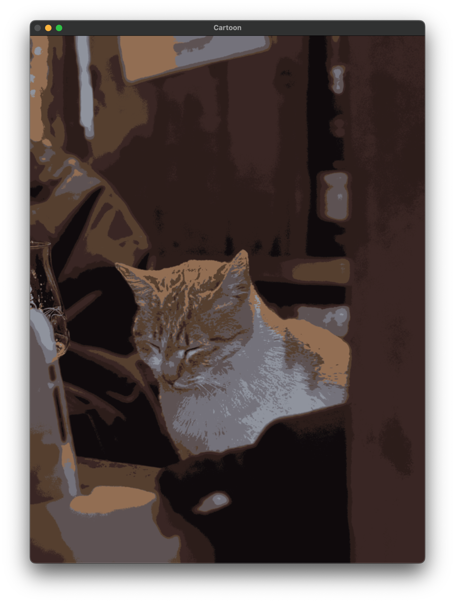
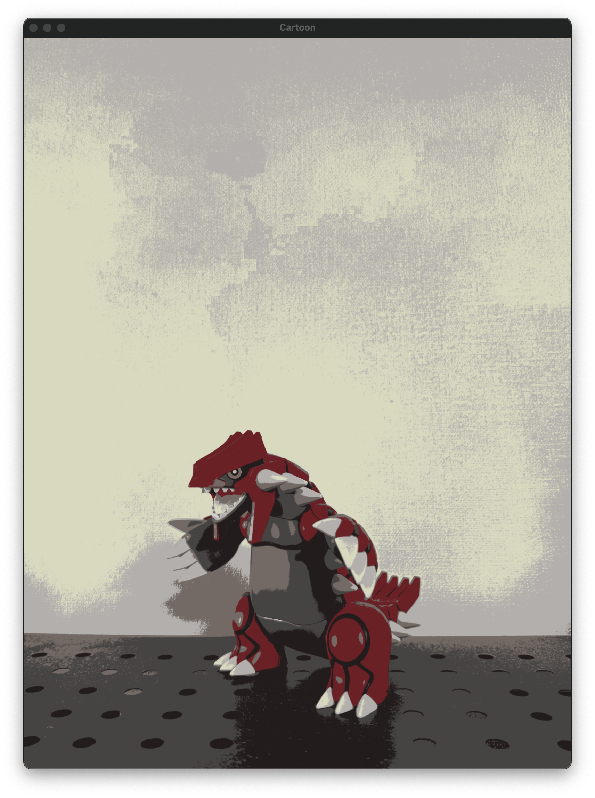
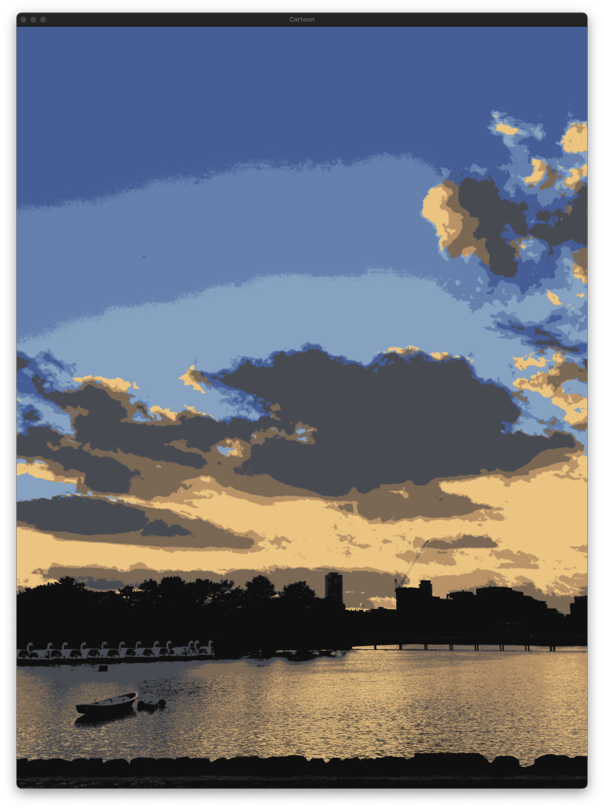
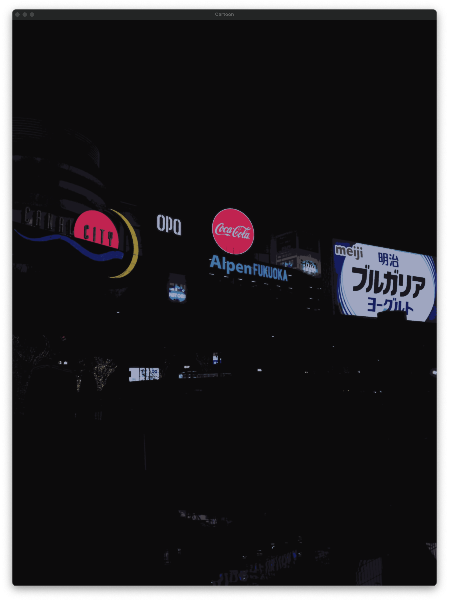

# 🖼️ Cartoon Filter

## 🎯 설명
컴퓨터 비전 기술을 활용해 일반 이미지를 만화 스타일로 변환하는 Cartoon Filter 입니다.

---

## 🧠 알고리즘 요약

- **엣지(윤곽선) 검출**: Canny Edge Detection을 사용해 선명한 윤곽선 추출
- **윤곽선 강조**: 엣지를 반전하고 팽창시켜 만화의 잉크 선 느낌 구현
- **색상 단순화**: K-means 클러스터링을 통해 색상 수를 줄여 만화처럼 단순한 색감 제공
- **블러 처리**: Bilateral Filter를 사용하여 색상 경계를 부드럽게 표현
- **결합**: 윤곽선과 색상 이미지를 `bitwise_and`로 합성하여 최종 카툰 스타일 이미지 생성

---

## 📸 데모 이미지

| Original | Cartoon |
|----------|---------|
|  |  |

### ✅ 잘 표현된 예시
- **설명**: 배경 색상이 밝고, 색상이 고르게 분할되어 있으며 윤곽선이 선명한 이미지

| Original | Cartoon |
|----------|---------|
|  |  |

| Original | Cartoon |
|----------|---------|
|  |  |

### ❌ 잘 표현되지 않는 예시
- **설명**: 배경이 어둡고 복잡하여 윤곽선을 잘 검출할 수 없는 이미지

| Original | Cartoon |
|----------|---------|
|  |  |

---

## ⚠️ 알고리즘의 한계

1. **배경이 어두운 이미지**의 경우 Canny 엣지에서 윤곽선 검출이 어려움
2. 색상 단순화(K-means)는 이미지 크기가 클 경우 계산 비용이 높음
3. 윤곽선이 너무 많거나 복잡하면 만화 스타일이 아니라 **노이즈처럼 보일 수 있음**
4. 인물 사진처럼 **디테일이 중요한 경우**, 윤곽선이 디테일을 뭉개는 경우가 있음
